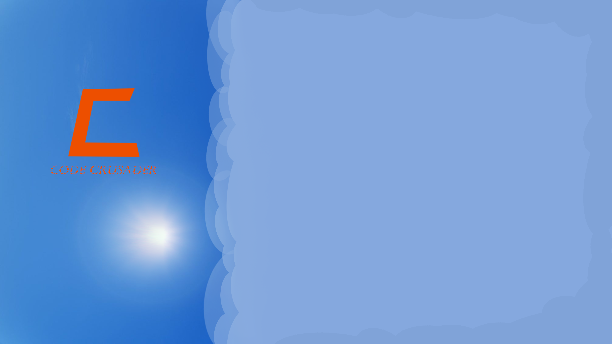
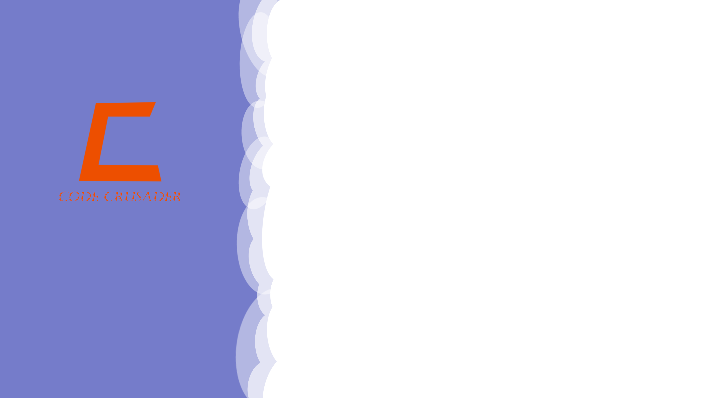
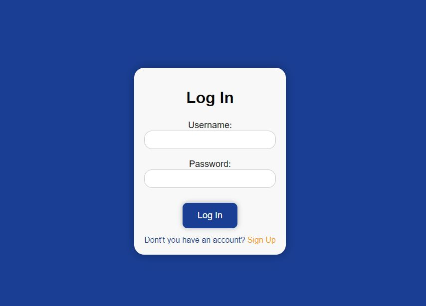
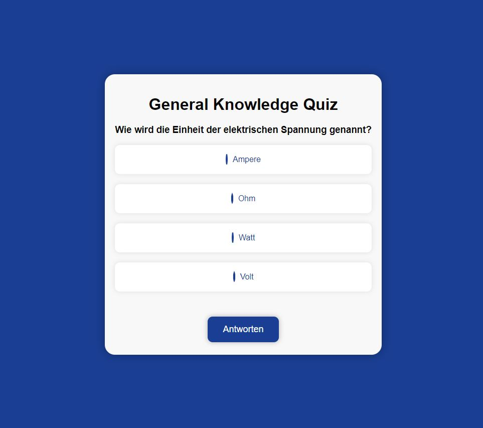

Tim Hötzel
{: .label .label-orange }

# Design decisions

## 01: First Ideas

Status
: **Work in progress** 

Updated
: 21.05.2023

### Problem statement

Finding a basic design and a consistent design that runs through the entire application.

### Regarded options

### Decision (as of yet)

### Reasoning / Intention

It is supposed to reflect "clouds" and the "sky". on the game side the clouds are moved/pushed away and replaced by a bright starry sky. The registration page should be full of clouds. Thto is is symbolize how the page is first locked and then opened in the game.

---

## 02: Final Design

We haven't thought about our design for a long time. When we wanted to start at that point, we didn't like the stand. We opted for a much simpler design.

These two design examples show what our design looks like. We wanted to keep it simple and stick to one design and relieve ourselves of the work on this point as well.