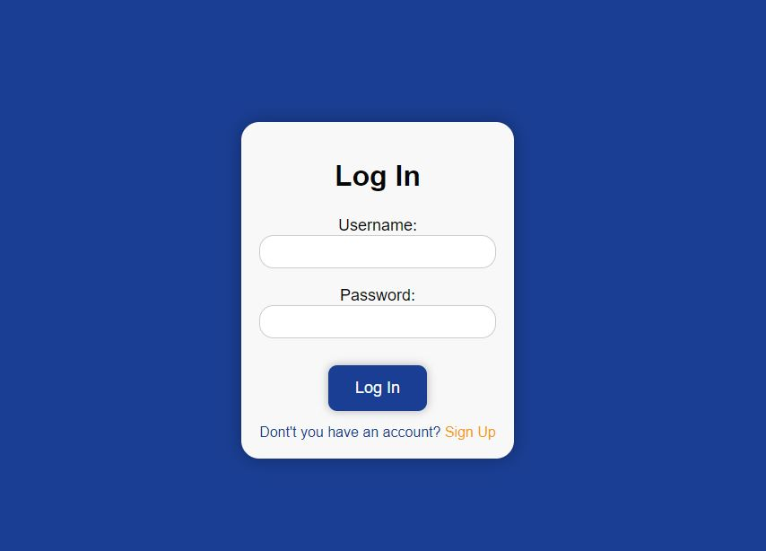
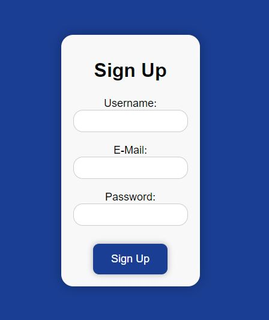
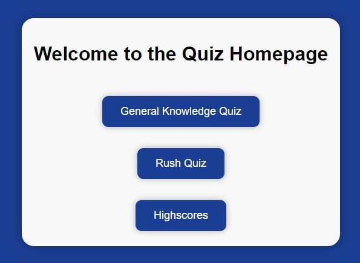
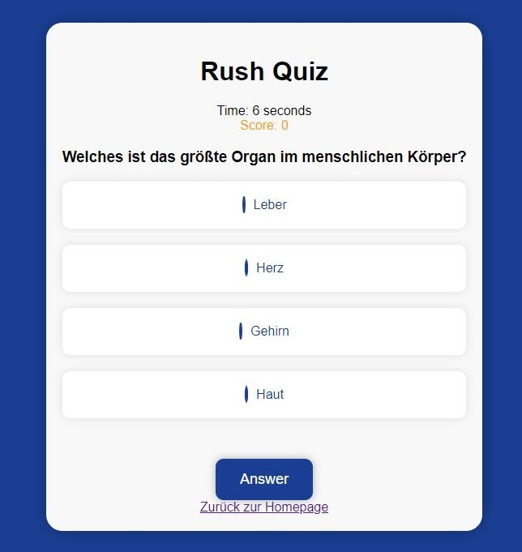
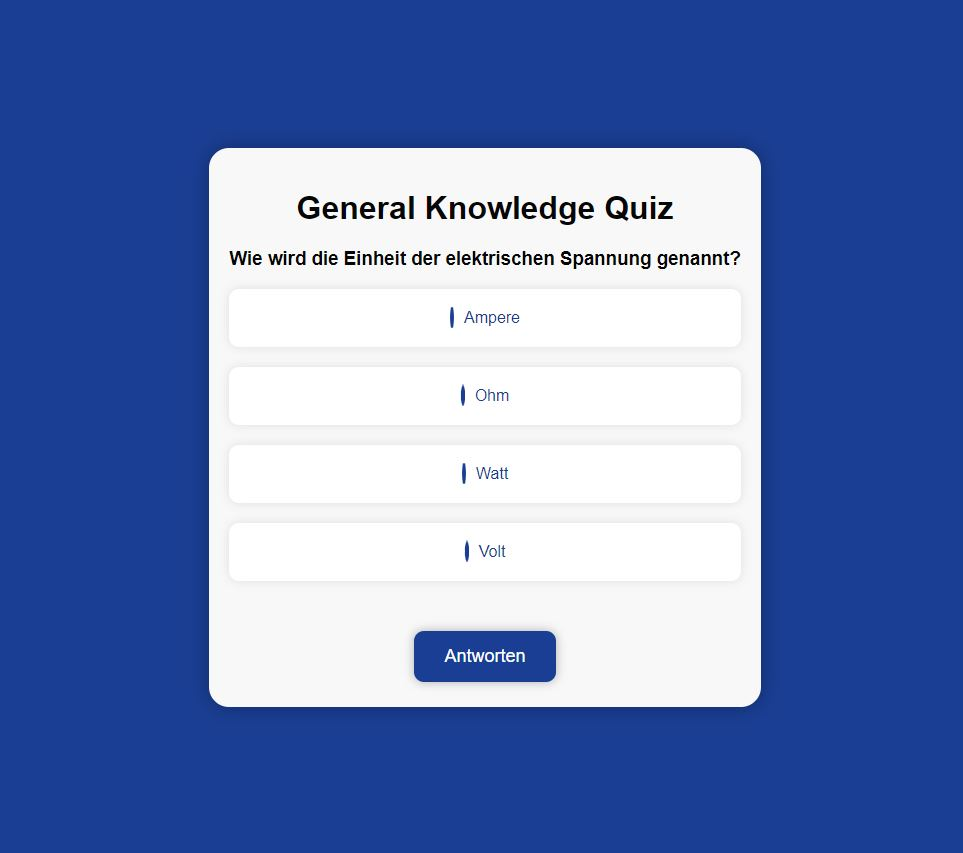
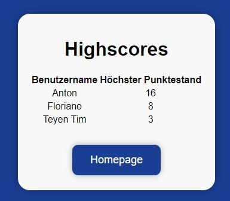

Tim Hötzel 
{: .label .label-green }

# API reference Index Screenshots hinzufügen

## Navigation  

### `index()`

**Route:** `/`

**Methods:** `POST` `GET` 

**Purpose:** [Short explanation of what the function does and why]

**Sample output:** NONE

## Login / Login

### `logIn()`

**Route:** `/logIn`

**Methods:** `POST` `GET`

**Purpose:** Login for existing users and forwarding to register

**Sample output:**
Shows the login screen with input fields for the registration and a SignUp button.

## Login / Sign Up

### `signup()`

**Route:** `/signup`

**Methods:** `POST` `GET`

**Purpose:** Non-existing users can register and then log in. User data is stored in the database.

**Sample output:**
Shows a registration form.

## Navigation / Homepage

### `homepage()`

**Route:** `/homepage`

**Methods:** `POST` `GET`

**Purpose:** Choice between the two implemented game modes

**Sample output:**
Two buttons with Rush and General Knowledge

## Quiz / Rush

### `quiz()`

**Route:** `/quiz`

**Methods:** `POST` `GET`

**Purpose:** gameloop

**Sample output:**
Shows a question, timer, score, answer button and whether the question was answered correctly or incorrectly.

## Quiz / General knowlage

### `gkquiz()`

**Route:** `/gkquiz`

**Methods:** `POST` `GET`

**Purpose:** gameloop

**Sample output:**
Shows a question, answer button and whether the question was answered correctly or incorrectly.

## Highscore

### `highscore()`

**Route:** `/highscore`

**Methods:** `POST` `GET`

**Purpose:** List of high scores

**Sample output:**
Table with user entries and their highest score.

