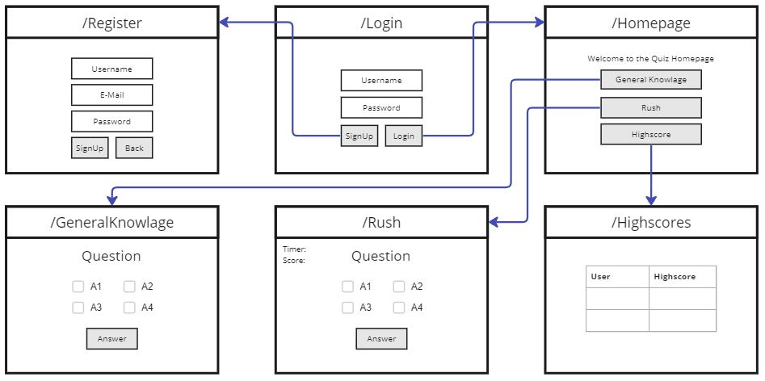

Anton Wagg
{: .label }

Tim Hötzel 
{: .label .label-green }

# App structure, incl. context

## Login/ Register
It is possible to register, the registration data is stored in a database which the login accesses to check whether a user exists.

## GeneralKnowlage
The general knowledge mode offers questions from various subject areas and is used to improve general knowledge. There is no timer and correct questions are not counted as points.

## Rush
Rush mode offers timed playback of questions, when time runs out the quiz is over. The quiz also ends when all questions have been answered. The correctly answered questions give a point and are added to the high score at the end if it is higher than the old one.

#### Not developed:  
This mode would combine all questions of the area when implementing topic-specific subjects with subcategories. It would be more challenging because you would have to be familiar with the whole subject area.

## Highscore
Highscores is a small approach to multiplayer usage. It always shows the highest  score of the respective user. Consistent with our value proposition challenge and competition. The high score motivates the player to try harder and also to outbid his friends.

## Login / module

**Route:** TBD

**Methods:** TBD

**Purpose:** Login page is used to register in the game. Among other things, it is also possible to assign individual high scores to users

**Sample output:**

--------

## Register

**Route:** TBD (To Be Decided)

**Methods:** TBD

**Purpose:** This is used to register your account, if you don't yet have one. Here the user is supposed to fill all the information which is need for a register.  
             The information gathered from the user is saved in the Database.

**Sample output:**

--------

## Game / Homepage

**Route:** TBD

**Methods:** TBD

**Purpose:** This is used to give an Overview of the game and also most importantly give the possibility to start the game. You are able to view your highscores and also to log out of the game. 

**Sample output:**

--------

## [Game / Highscore]

**Route:** TBD

**Methods:** TBD

**Purpose:** This is used to display the highscores of each time played. 
